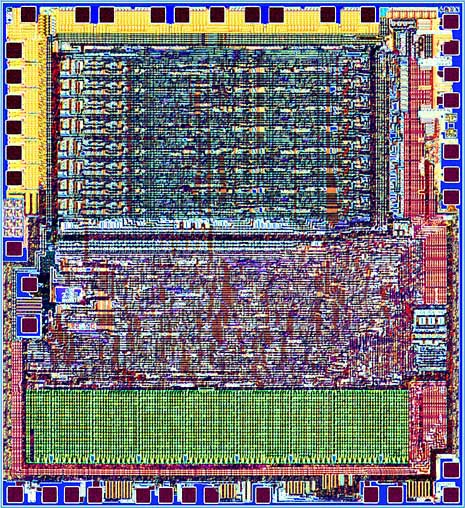

MOS 6502 の不正命令の実際の動作
===============================

(原文: [How MOS 6502 Illegal Opcodes really work | pagetable.com](http://www.pagetable.com/?p=39))

MOS 6502 のオリジナルのNMOS版は Commodore 64, Apple II, Nintendo
Entertainment System(NES) といったコンピュータで使われており、不正命令
を持つことで有名だ: 256個の可能なオペコードのうち、151個がアーキテク
チャで定義されているが、残る105個の未定義オペコードにも有用なものが多
い。

これらをテストおよび文書化するために
[多くの](http://web.archive.org/web/20131208051224/http://viceteam.org/plain/64doc.txt)
[記事が](http://www.ffd2.com/fridge/docs/6502-NMOS.extra.opcodes)
[書か](http://members.chello.nl/taf.offenga/illopc31.txt)
[れて](http://www.oxyron.de/html/opcodes02.html)
[きた](http://bbc.nvg.org/doc/6502OpList.txt)
が、これらの由来を解説しようとする文書は見当たらない。ここではそれを行
う。


ブロック図
----------
全ての 6502 データシートにはブロック図が付いているが、これらは役に立た
ない。というのは、これらは単純化しすぎていたり、部分的に間違っていた
り、命令デコードの動作を説明していなかったりするからだ。以下のより詳し
い図はずっと有用だ:


(出典: [Apple II things](http://homepage.mac.com/jorgechamorro/a2things/))


デコードROM (PLA)
-----------------

ブロック図全体を理解する必要はない。重要な部分は左側にある:
オペコードを保持する instruction register と、現在の命令内クロックサイ
クル(T0 から T6)が 130x21 bit (各21bitの130ライン)のデコードROMに渡さ
れる。ダイ写真では下の緑の領域に相当する。



(出典: [Molecular Expressions: Chip Shots - MOS Integrated Circuits - 6502](http://micro.magnet.fsu.edu/chipshots/mos/6502small.html))

同時期の他のCPUは命令の解読にマイクロコードを使っていたが、6502はこの
130x21 bit PLAを備えていた。PLAの全ラインはオペコードと現在のクロック
サイクルを見て、それらが条件を満たす場合に発火する。少し単純化すると、
各ラインはこのようになっている:

|ON bits          |Off bits         |timing             |
|-----------------|-----------------|-------------------|
|_7 6 5 4 3 2 1 0_|_7 6 5 4 3 2 1 0_|_T6 T5 T4 T3 T2 T1_|

(詳細は
[http://impulzus.sch.bme.hu/6502/](http://web.archive.org/web/20110804220220/http://impulzus.sch.bme.hu/6502/letolt.php3)
を見よ; このサイトを部分的に英訳したものが
[ここ](http://www.downloads.reactivemicro.com/Public/Electronics/Reverse%20Engineering/)
にある)。

* **"ON bits"** は、このラインが発火するために**セット**されねばならな
  いbitを指定する。
* **"OFF bits"** は、このラインが発火するために**クリア**されねばなら
  ないbitを指定する。

6502のオペコード表のレイアウトを見ると、似たようなオペコードの効果を一
般化する簡単なルールを見出せる。例えば、分岐命令はこのようにエンコード
される:

```
%aab10000
```

ここで "aa" は条件(00=N, 01=V, 10=C, 11=Z)であり、"b" はフラグが立って
いる場合に分岐が起こるかどうかを決める。

よって、以下のラインは任意の分岐命令の第1サイクルで発火する:

|ON bits          |Off bits         |timing             |
|-----------------|-----------------|-------------------|
|_7 6 5 4 3 2 1 0_|_7 6 5 4 3 2 1 0_|_T6 T5 T4 T3 T2 T1_|
| 0 0 0 1 0 0 0 0 | 0 0 0 0 1 1 1 1 | 0  0  0  0  0  1  |

今後、読みやすさのために異なる記法を用いる:

|mask    |cycle|description                          |
|--------|-----|-------------------------------------|
|XXX10000|T1   |T1 of Bcc: 分岐先オフセットのフェッチ|

あるラインが発火するとき、"1" を出力する。そして、ブロック図にある「ラ
ンダム制御論理」がいくつかのラインの出力を AND/OR で組み合わせ、その結
果をCPUの各種コンポーネントに渡す。その結果、例えば分岐命令の場合は分
岐先のオフセットをフェッチする、などの動作をする。

1つのラインが複数のオペコードに対して発火することもありうる。そういっ
たオペコードはエンコーディングと振る舞いにおいて似通っている: 例えば、
"LDA abs", "ORA abs" および "AND abs" はT1サイクルでは全て同じこと(ア
ドレス下位Byteのフェッチ)を行う。よって、これら全てのオペコードにマッ
チするラインが存在し、そのラインがメモリからのフェッチとPCのインクリメ
ントを発生させる。また、1つの命令内の任意のサイクルで複数のラインが同
時に発火することもあり、単一のラインの効果を組み合わせた動作となる。


LDA と LDX が LAX になる
------------------------

未定義命令は多数存在する。6502の設計者はそれらに対するPLAラインを特に
設けたわけではないのだが、それらのオペコードは定義済みオペコードに似て
いるために、発火するラインは存在しうる。

例としてオペコード $AF を取り上げよう。これは "LAX absolute" だ。これ
はメモリ内の絶対アドレスから値をロードし、それを A と X に同時にストア
する。これはオペコード $AD (LDA abs) と $AE (LDX abs) の組み合わせに
なっている。

命令 "LDA/LDX/LDY abs" ($AC/$AD/$AE) は4サイクルから成る:

* 第1サイクルでアドレス下位Byteをフェッチする。
* 第2サイクルでアドレス上位Byteをフェッチする。
* 第3サイクルでメモリから値をフェッチし、それを A/X/Y にストアする。
* 第4サイクルで次のオペコードをフェッチする。

T1, T2, そして T4サイクルはこれら3つで共通であり、これらは似たようなエ
ンコードになっている。よって、以下の3つのPLAラインがこれらの命令の検
出、および特定のタスクを実行するためのCPUに対するシグナルとして使われ
る:

|mask    |cycle|description                                  |
|--------|-----|---------------------------------------------|
|101011XX|T1   |T1 of $AC/$AD/$AE: アドレス下位Byteのフェッチ|
|101011XX|T2   |T2 of $AC/$AD/$AE: アドレス上位Byteのフェッチ|
|101011XX|T4   |T4 of $AC/$AD/$AE: 次のオペコードのフェッチ  |

マスク %101011XX は $AC/$AD/$AE だけでなく、未定義オペコード $AF に対
しても発火する: よって、$AF (LAX) は T1/T2/T4 サイクルではLDA/LDX/LDY
と同様に振る舞う(つまり、16bitのアドレスをフェッチし、最後に次のオペ
コードをフェッチする)。

T3サイクルは3命令全てで異なっている。よって、命令ごとに異なったライン
で処理されねばならない:

|mask    |cycle|description                                  |
|--------|-----|---------------------------------------------|
|10101100|T3   |T3 of $AC: Y へ読み込む                      |
|101011X1|T3   |T3 of $AD: A へ読み込む                      |
|1010111X|T3   |T3 of $AE: X へ読み込む                      |

(実を言うと、実際のPLAのラインはこのように分かれてはいない(より多くの
X bitを含んでいる)かもしれない。というのは、"ORA absolute" のような似
た命令がこのラインを共有しているかもしれないからだ。)

$AC に対するラインは値 $AC に対してのみ発火するが、$AD と $AE に対する
ラインにはそれぞれ "どちらでもよい" bitがある。$AF のビットフィールド
は %10101111 だが、これはどちらのマスクに対しても真だ。よって、$AF の
T3サイクルでは $AD と $AE のラインが両方発火する。

T3サイクルでは、LDA/LDX/LDY は全てメモリから値を読み、その結果を内部の
"SB" バスへ出力するという共通点がある。"LDA" はこれに加えて "SB->AC"制
御線を "1"にセットし、これにより SB からアキュムレータへ値が読み込まれ
る。同様に、LDX は "SB->X" を "1" にセットして SB バスから X へ読み込
み、LDY は SB から Y へ読み込む。

LDA と LDX のラインが両方発火するために、アキュムレータと X レジスタの
両方が SB バスから値をロードするコマンドに送られ、従って $AF は実質的
に LAX となる: アキュムレータと X へのロード。


KIL オペコード
--------------

多くの "KIL" オペコードがある。これらはCPUを停止させ、RESET以外では
(IRQやNMIでさえ)回復できなくなる。

これを理解するために、命令がとりうる状態を見てみよう。オペコードの
フェッチ後、CPUはT1サイクルにある。CPUはオペコードとサイクル番号をPLA
に渡し、PLAに従ってこのサイクルですべきことを実行する。そしてCPUは T
ビットフィールドを左へ1回シフトし、T2 ラインが "1" となり、次は T3 ラ
イン、といった具合だ。T ラインは T1 から T7 の合計7つある。各命令の最
後で、PLAは T ビットフィールドをリセットするので、次の命令は再び T1=1
で開始する。

だが T がリセットされなかったらどうなるだろうか?これが起こるのは、T の
7通りの状態全てにおいて、現サイクルで終了する命令に属するラインが1つも
発火しなかった場合に起こりうる。T はT7ステートに至るまで左シフトされ、
T7ステートでもう1回左シフトされて T の1のbitがシフトアウトされる - す
ると T の全bitが0となり、もはやどのPLAラインも発火できなくなる。

全てのIRQおよびNMI要求は常に現在の命令が終了するまで遅延される。つま
り、T がリセットされるまでだ。だが T は決してリセットされないので、全
てのIRQとNMIは実質的に無効になる。


次は?
-----

多くの不正命令があり、その中にはとても奇妙な振る舞いをするものもあれ
ば、不安定だとして文書化されたものもある。これら全てを研究することで、
6502の内部設計に関する多くの興味深い詳細が明らかになるだろう。
